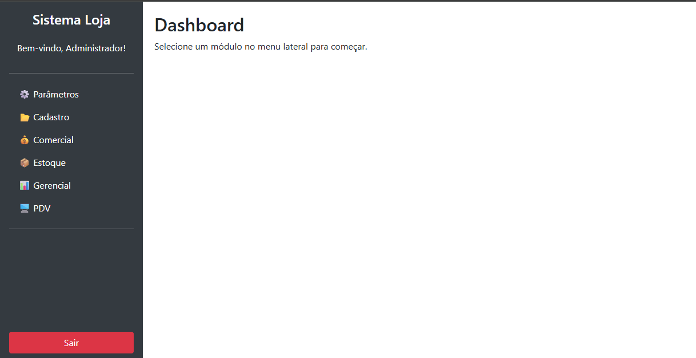
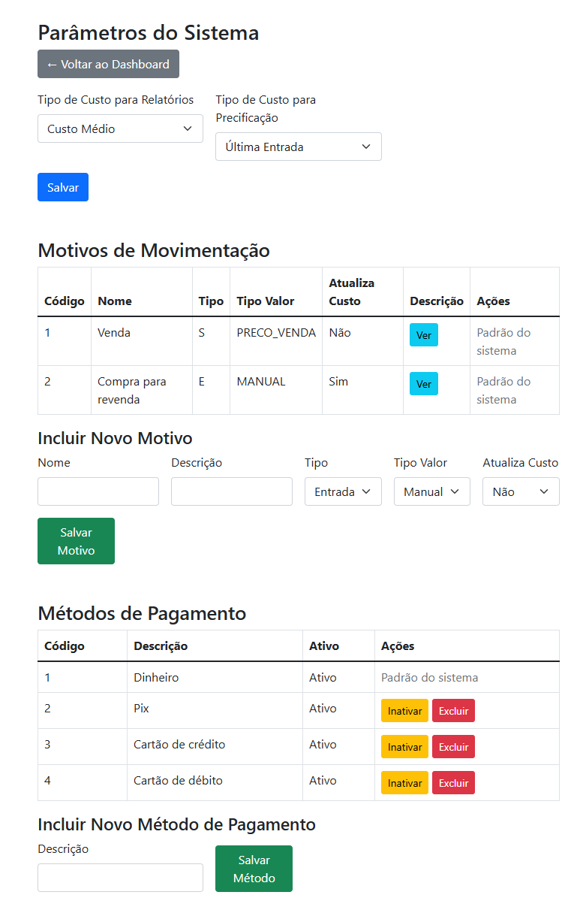
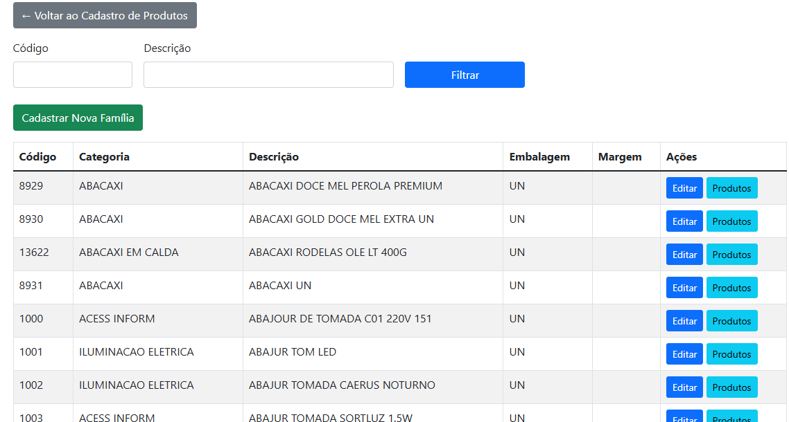
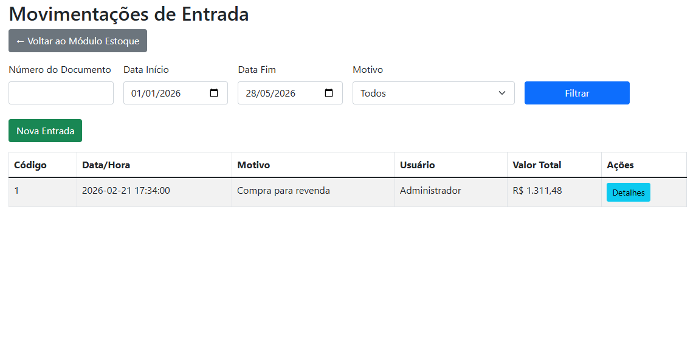
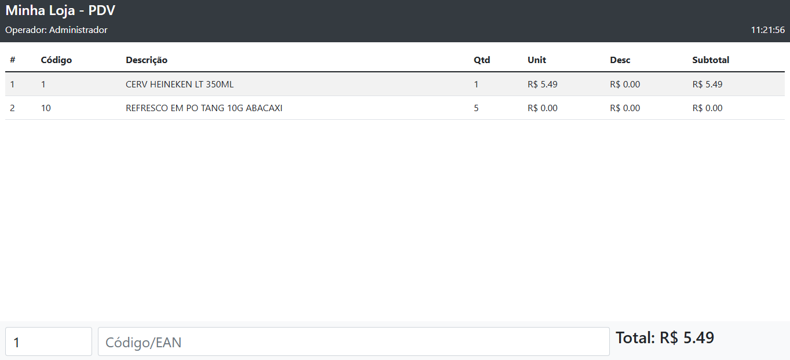
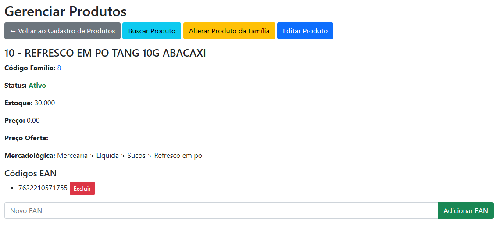

# minha_loja
Sistema não fiscal voltado para pequenos comércios varejistas, com controle de estoque, gestão comercial, movimentações de produtos, relatórios gerenciais e ponto de venda (PDV).

Projeto modular em desenvolvimento contínuo, focado em operações comerciais e controle operacional do varejo.

## 🚧 Status do Projeto

Este sistema encontra-se em desenvolvimento contínuo.

Atualmente, diversos módulos já possuem estrutura funcional e operacional, enquanto outros seguem em processo de implementação, refinamento e melhorias.

O objetivo do projeto é evoluir gradualmente para um sistema completo de gestão comercial, estoque e ponto de venda voltado para pequenos comércios varejistas.

## 📌 Status dos Módulos

✅ Implementado
🚧 Em desenvolvimento
❌ Removido/descartado

### ⚙️ Parâmetros

Responsável pelas configurações gerais do sistema:

* ✅ Tipo de custo utilizado para precificação;
* ✅ Métodos financeiros;
* ✅ Motivos de movimentações de entrada e saída;
* ✅ Configurações operacionais do sistema.

---

### 📦 Cadastro

Módulo responsável pela estrutura base do sistema:

* ✅ Cadastro de árvore mercadológica;
* ✅ Cadastro de produtos e famílias;
* ✅ Cadastro de usuários e permissões.

---

### 💰 Comercial

Responsável pela gestão comercial dos produtos:

* ✅ Formação e manutenção de preços;
* 🚧 Criação de ofertas promocionais;
* 🚧 Controle de vigência;
* 🚧 Relatórios de alteração de preços.

---

### 📥 Estoque

Controle operacional das movimentações de estoque:

* ✅ Entrada de mercadorias;
* ✅ Saída de mercadorias;
* ❌ Inventário;

---

### 📊 Gerencial

Módulo de relatórios e consultas:

* 🚧 Relatórios de vendas;
* 🚧 Relatórios de estoque;
* 🚧 Movimentações de produtos;
* 🚧 Consultas gerenciais;
* 🚧 Relatórios financeiros.

---

### 🛒 PDV (Ponto de Venda)

Módulo responsável pelas operações de venda:

* ✅ Finalização de vendas;
* ✅ Métodos de pagamento;
* ✅ Cancelamento de itens;
* ✅ Aplicação de descontos;
* ✅ Controle operacional do caixa.

## 🖼️ Screenshots do Sistema

### 🏠 Tela Inicial (HOME)

Tela principal do sistema contendo atalhos rápidos para os módulos operacionais e gerenciais.

---

### ⚙️ Parâmetros do Sistema

Módulo responsável pelas configurações gerais do sistema, incluindo métodos financeiros, tipos de custo e parâmetros operacionais.

---

### 📦 Cadastro de Produtos

Tela responsável pelo cadastro e manutenção de produtos do sistema.

---

### 📥 Movimentação de Estoque

Controle de entradas e saídas de mercadorias.

---

### 🛒 PDV

Estrutura inicial do módulo de ponto de venda.

---

### 📊 Consulta e gerenciamento de produto

Local onde ver informações e gerencia o produto.

## 🛠️ Tecnologias Utilizadas

- PHP
- MySQL / MariaDB
- Apache
- Bootstrap 5
- JavaScript
- HTML5 / CSS3
